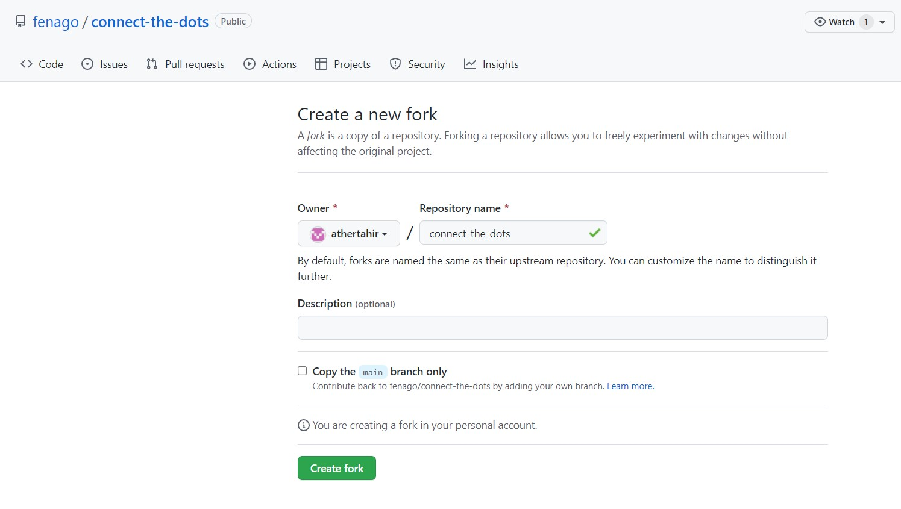
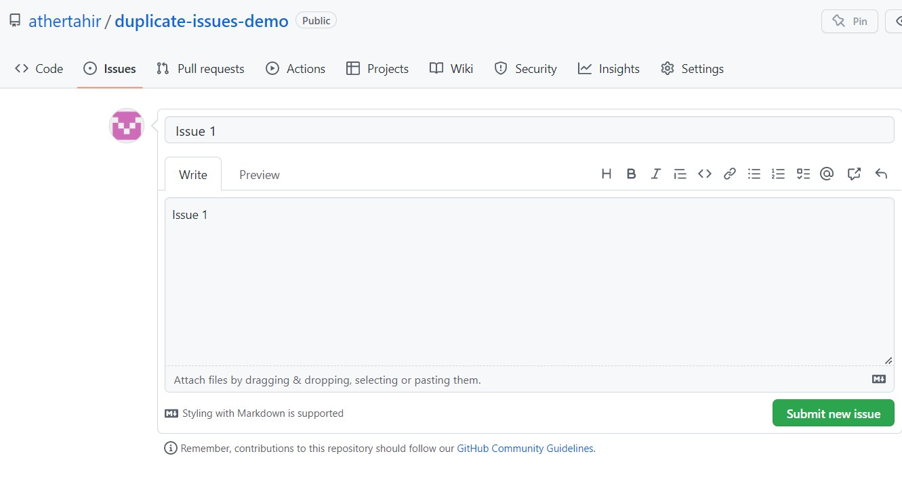
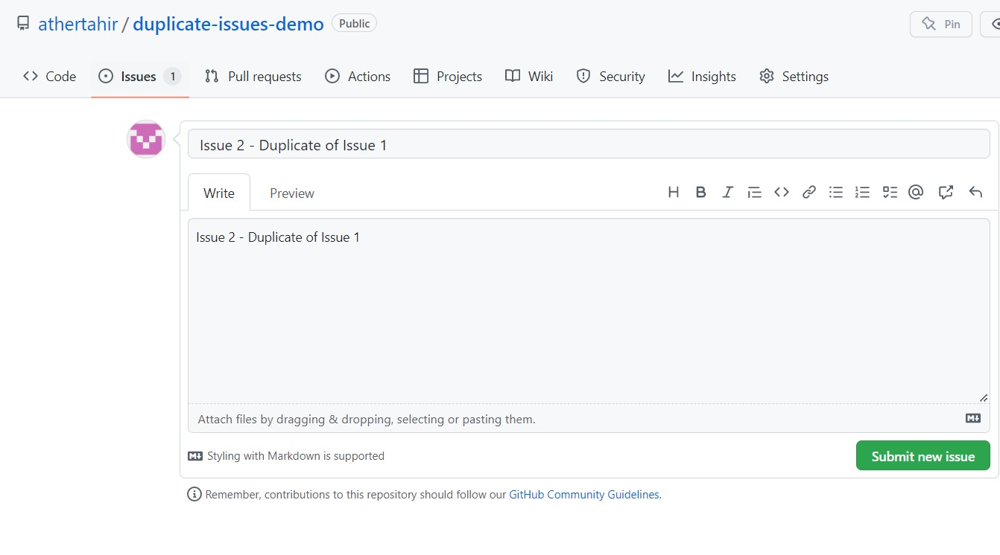
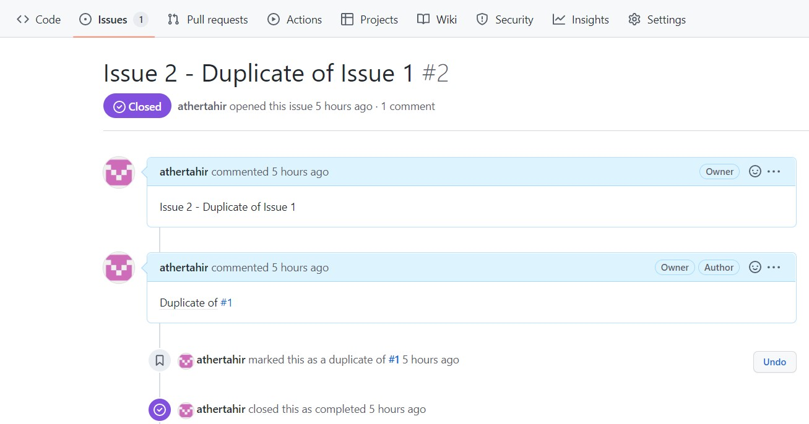

# Connect the Dots in a GitHub Repository

Have you ever worked in a repository with a lot of history? Perhaps you've had to track down related issues and pull requests in the past, or you've had to find who committed a particular change. If you've ever found yourself in any of these situations, you'll know how important it is to navigate your workspace.

- **Who is this for**: Developers, GitHub users, users new to Git, students, managers, and teams.
- **What you'll learn**: 
  - Search history to find context.
  - Make connections within GitHub to help others find things.
- **What you'll build**: Repository with existing commits, duplicated issues.

## How to start this course

1. Open following URL in browser, click **Fork** and open the link in a new tab.
   `https://github.com/fenago/github-pages`

   
2. In the new tab, follow the prompts to create a new repository.
   - For owner, choose your personal account or an organization to host the repository.
   - **Important! Make sure to uncheck box `Copy the main branch only`**.
     

<h2>Step 1: Resolve Duplicate Issues</h2>

When you want to create a crosslink, start typing the title of an issue or pull request directly after you type the `#` symbol. GitHub will suggest issues or pull requests that will link to the right place.

### Activity: Create New Issues

1. Create new repository `duplicate-issues-demo`.

2. Click `Issues` tab and create new issue `Issue 1`:

 

3. Create another new issue `Issue 2`:

 

### Activity: Find and close the cross-linked issue

1. Navigate to the issue #2
2. Type "Duplicate of #1" as a comment and close issue #1

 

<h2>Step 2: Find a commit in history</h2>

An important part of version control is the ability to look into the past. By using `git blame`, and finding the story behind a commit, we're able to do more than _blame_ people for code. We're able to see the story around why a commit was made. What is the associated pull request? Who approved the pull request? What tests were run on that commit before it was merged?

The obvious reason to find things in history is to know about the history. With issues and pull requests, we see a more complete story about about the history, not just just the bare minimum.

### What's `git blame`?

`git blame` is a Git functionality that shows what revision and author last modified each line of a file. Information like who made a commit, when, and even why can be found this way. If you aren't sure who introduced certain changes to a file, you can use `git blame` to find out. While `git blame` sounds rather accusatory, this can be used to understand the context around decisions.

### What's a Secure Hash Algorithm (SHA)?

A SHA is a reference to a specific object. In this case, it's a reference to a commit. On GitHub, you can look at a specific commit to see the changes introduced, by whom, and if they were a part of a pull request.

### Activity: Find commit in history

1. Navigate to the Code tab of your repository
2. Click `docs` to navigate into the `/docs` directory
3. Click `_sidebar.md` to view the file
4. On the top right side of the file, click **Blame** to see the details of the most recent revision
5. Click the commit message, `new bug in _sidebar.md` to see the commit details

<h2>Step 3: Fix a broken sidebar</h2>

Thanks for finding that commit! We now know that the sidebar was indeed added, and it was done in that commit. Let's see if we can dig a little deeper to find out if any planning or conversation, using comments, occurred around this change. 

As we've already seen, conversations in issues and pull requests can reference other work, but the amount of context goes much further than crosslinks. Remember, Git is version control! For example, the commit that you found in the last step is connected with much more information such as: 

- Who made the commit.
- What other changes were included.
- When the commit was made.
- Which pull request the commit was a part of.

The pull request is important because it goes beyond knowing when a commit happened. You can know _why_ a commit happened. Finding history is not about _blaming_ anyone, but about seeing the bigger picture. Why were decisions made? Who was involved? What were the build outputs and test results for each commit? Who requested changes, and who approved them?

### Finding a pull request from a commit

When you're looking at a commit on GitHub, you can see a lot of information. From this view, you can also find a link to the pull request in which the commit was created. We'll use this in the next step.

### Activity: Fix a broken sidebar

1. In the main branch [Edit the `docs/_sidebar.md` file](/docs/_sidebar.md).
2. Correct the spelling of the reference `(doc-references__.md)` on line 4 by changing it into `(doc-references.md)`.
3. Select or create a new branch `fix-sidebar` for this commit and start a pull request. 
4. Make sure that **main** is selected for **base:** and **fix-sidebar** for **compare:**.
5. Using the **Assignees** section on the right side, assign yourself to the pull request.
6. In the PR comment add 'Closes #1' and autolink issue #1.
7. Click **Create pull request** and wait about 20 seconds.
8. Merge this pull request.
9. Delete the branch 'fix-sidebar'.
10. Refresh this page for the next step.

<h2>Finish</h2>

### Congratulations, you've completed this course!

In this course, you've learned a lot about finding and sharing information. Within a GitHub repository, you can find history about what changes were made, and more importantly, _why_ changes were made.
